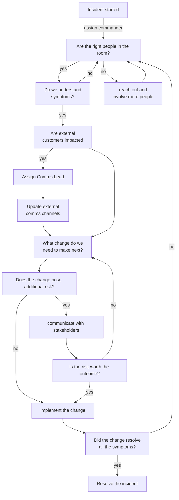

# Incident Commander

Incident Commander, first 15 minutes (... and the rest of the minutes), or *"How to start (and continue) with Incident Command"*

## Why?

With commanding incidents, the worst part is to start doing it. Once you start, it only gets easier.
Well, it doesn't, but starting is pretty tough still.

So, to help you start with this fine discipline, I've prepared a general flowchart for commanding responses to typical disruptions happening in IT.

## Incident Command Flowchart

## Steps commented & explained

### Incident started
Someone decided that something warrants an incident. It is important that people are able to trust themselves when starting incidents, it is better to be safe than sorry. This can be done by a customer focusing role, but also by roles without direct customer contact.  
  
Remember though, internal customers are customers too.

### Assign commander
If you're the only one knowing about the incident, why not assign that role to yourself? Before you and the team get to any tech work, there will be some organisation work happening, so it is good that the **commander role** is assigned and the responsibilities are taken care of right from the start.

### Are the right people in the room?
Important question! At this point, you probably have some people involved in the incident, depending on how well your service ownership model works.  
  
Ask the team if they're confident they'll be able to solve the problem or if they'd like to involve more responders. 

These might be:
- more experienced engineers in the same field
- people having more context

Some cultures and personalities can be reluctant to ask for help, so as a commander, you need to make sure that people are comfortable pulling in more people if needed. 

### Do we understand the symptoms?
You probably collect tons of metrics, logs, traces. Do you know which ones matter in this specific case? Do you understand the causality? If not sure, you might want to either take time to research or pull in more people (see arrow going back to "right people").

### Are external customers impacted?
At this point, you need to figure out if what's happening is impacting people and to what degree. Think about the future, too.  
  
If your customers live in a specific timezone and it is night for them at the moment, they might be okay now, but they're likely to be impacted in the near future. Calculate that into your preps.

If unsure, **check for signs of customer impact** - that might be your SLO breaches, amount of tickets being open. Communicate openly in your company's more populated channels to find out. Be transparent.

### Assign Comms Lead
Comms Lead is useful to handle things related to communication to external customers. They can take care of handling the *status page updates* and other comms to keep the public informed, while you focus on addressing the tech issues.

TODO: Risk of changes

<!-- ## Roadmap
If you have ideas for releases in the future, it is a good idea to list them in the README.

## Contributing
State if you are open to contributions and what your requirements are for accepting them.

For people who want to make changes to your project, it's helpful to have some documentation on how to get started. Perhaps there is a script that they should run or some environment variables that they need to set. Make these steps explicit. These instructions could also be useful to your future self.

You can also document commands to lint the code or run tests. These steps help to ensure high code quality and reduce the likelihood that the changes inadvertently break something. Having instructions for running tests is especially helpful if it requires external setup, such as starting a Selenium server for testing in a browser.

## Authors and acknowledgment
Show your appreciation to those who have contributed to the project.

## License
For open source projects, say how it is licensed.

## Project status
If you have run out of energy or time for your project, put a note at the top of the README saying that development has slowed down or stopped completely. Someone may choose to fork your project or volunteer to step in as a maintainer or owner, allowing your project to keep going. You can also make an explicit request for maintainers. -->
